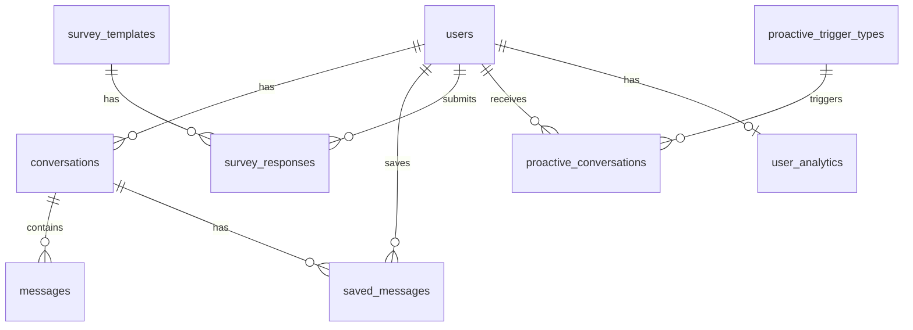

# 부인과 챗봇 데이터베이스 스키마

> 최종 업데이트: 2025-12-23
> Prisma + Supabase (PostgreSQL + pgvector)

## 테이블 개요



---

## 핵심 테이블

### 1. users (사용자)

| 필드 | 타입 | 설명 |
|------|------|------|
| id | UUID | auth.users 참조 |
| email | VARCHAR(255) | 이메일 |
| pregnancy_week | INT | 현재 임신 주차 |
| onboarding_data | JSONB | 온보딩 응답 데이터 |
| ai_persona_id | VARCHAR(50) | 선택한 AI 페르소나 |
| push_token | TEXT | Expo Push 토큰 |
| kakao_id | VARCHAR(100) | 카카오 OAuth ID |

### 2. conversations & messages (채팅)

**conversations:**
| 필드 | 타입 | 설명 |
|------|------|------|
| id | UUID | PK |
| user_id | UUID | FK → users |
| title | VARCHAR(200) | 대화 제목 |
| message_count | INT | 메시지 수 |
| status | VARCHAR(20) | active, archived, deleted |

**messages:**
| 필드 | 타입 | 설명 |
|------|------|------|
| id | UUID | PK |
| conversation_id | UUID | FK → conversations |
| role | VARCHAR(20) | user, assistant, system |
| content | TEXT | 메시지 내용 |
| attachments | JSONB | 첨부파일 (이미지 등) |
| rag_sources | JSONB | RAG 검색 결과 |

> **SSE 처리**: 스트리밍은 클라이언트에서 처리, **완료된 메시지만 DB 저장**

---

## 설문 시스템

### 3. survey_templates (Google Forms 스타일)

| 필드 | 타입 | 설명 |
|------|------|------|
| id | UUID | PK |
| title | VARCHAR(200) | 설문 제목 |
| pregnancy_week_min/max | INT | 대상 주차 범위 |
| **form_schema** | JSONB | 폼 스키마 (아래 참조) |
| schema_version | VARCHAR(20) | 스키마 버전 |
| is_ai_assisted | BOOLEAN | AI 추가 질문 여부 |

**form_schema 예시:**
```json
{
  "sections": [
    {
      "title": "오늘의 기분",
      "questions": [
        {
          "id": "q1",
          "type": "single_choice",
          "label": "오늘 컨디션은 어떠세요?",
          "options": ["좋아요 😊", "보통이에요", "힘들어요 😢"],
          "required": true
        },
        {
          "id": "q2",
          "type": "scale",
          "label": "피로도 (1-5)",
          "min": 1,
          "max": 5,
          "minLabel": "괜찮아요",
          "maxLabel": "매우 피곤해요"
        }
      ]
    }
  ]
}
```

**question types:**
- `single_choice` - 단일 선택
- `multi_choice` - 다중 선택
- `scale` - 척도 (1-5, 1-10 등)
- `text` - 텍스트 입력
- `date` - 날짜 선택

### 4. survey_responses

| 필드 | 타입 | 설명 |
|------|------|------|
| responses | JSONB | `{ "q1": "좋아요", "q2": 3 }` |
| ai_generated_questions | JSONB | AI가 생성한 추가 질문/응답 |

---

## 선제적 대화 (pg_cron)

### 5. proactive_trigger_types

| 필드 | 타입 | 설명 |
|------|------|------|
| id | VARCHAR(50) | PK (예: daily_check) |
| name | VARCHAR(100) | 표시 이름 |
| cron_expression | VARCHAR(50) | pg_cron 표현식 |
| message_template | TEXT | AI 프롬프트 템플릿 |

**기본 데이터:**
```sql
INSERT INTO proactive_trigger_types VALUES
('daily_check', '매일 안부 인사', '0 9 * * *', '...'),
('milestone', '임신 주차 마일스톤', NULL, '...'),
('symptom_follow_up', '증상 추적', NULL, '...');
```

### 6. proactive_conversations

| 필드 | 타입 | 설명 |
|------|------|------|
| trigger_type_id | VARCHAR(50) | FK → proactive_trigger_types |
| scheduled_at | TIMESTAMPTZ | 예정 시간 |
| sent_at | TIMESTAMPTZ | 발송 시간 |
| status | VARCHAR(20) | pending, sent, read, responded |

**Supabase Edge Function으로 pg_cron 트리거:**
```sql
-- pg_cron 설정
SELECT cron.schedule('daily-check', '0 9 * * *', 
  $$SELECT net.http_post('https://your-app.supabase.co/functions/v1/proactive-chat')$$
);
```

---

## RAG (pgvector)

### 7. pregnancy_documents

| 필드 | 타입 | 설명 |
|------|------|------|
| title | VARCHAR(500) | 문서 제목 |
| content | TEXT | 청크된 내용 |
| pregnancy_week | INT | 관련 임신 주차 |
| category | VARCHAR(100) | 카테고리 |
| **embedding** | VECTOR(1536) | Gemini 임베딩 |

**유사도 검색 함수:**
```sql
SELECT * FROM match_pregnancy_documents(
  query_embedding := $1,
  match_threshold := 0.7,
  match_count := 5,
  filter_week := 12  -- 임신 12주차 필터
);
```

---

## 기타 테이블

### 8. ai_personas

| 필드 | 타입 | 설명 |
|------|------|------|
| id | VARCHAR(50) | PK (default, professional, concise) |
| system_prompt | TEXT | AI 시스템 프롬프트 |
| tone | VARCHAR(50) | warm, professional, concise |

### 9. saved_messages (메시지 저장/공유)

| 필드 | 타입 | 설명 |
|------|------|------|
| share_token | VARCHAR(100) | 공유 링크 토큰 |
| share_expires_at | TIMESTAMPTZ | 공유 만료 시간 |

---

## 마이그레이션 명령어

```bash
cd apps/web

# 스키마 푸시 (개발)
pnpm db:push

# 마이그레이션 생성 (프로덕션)
pnpm db:migrate

# Prisma Studio (GUI)
pnpm db:studio
```
