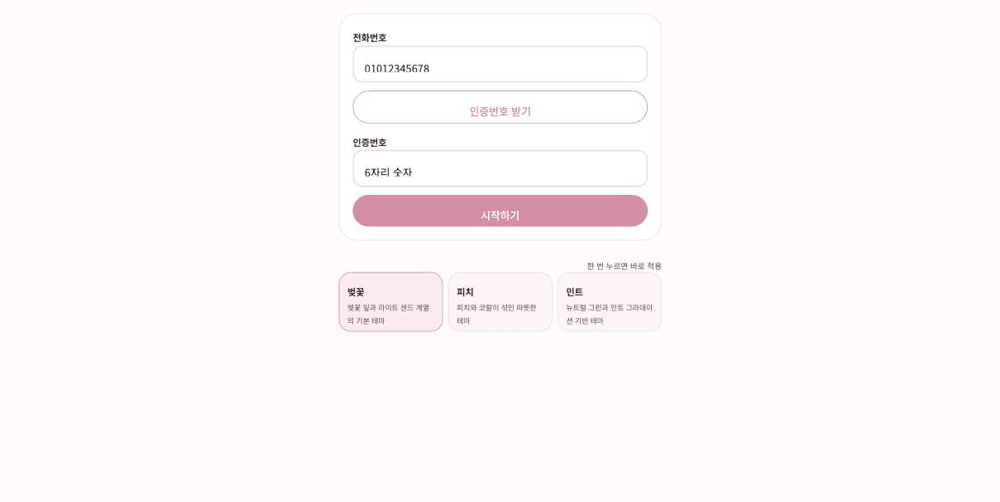
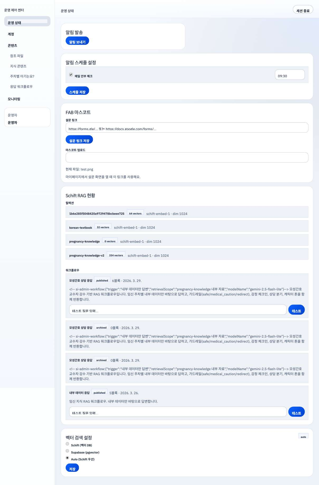
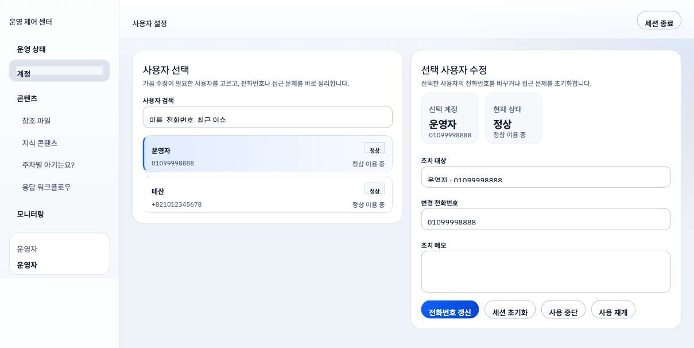
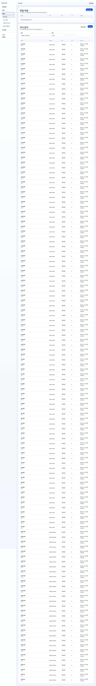
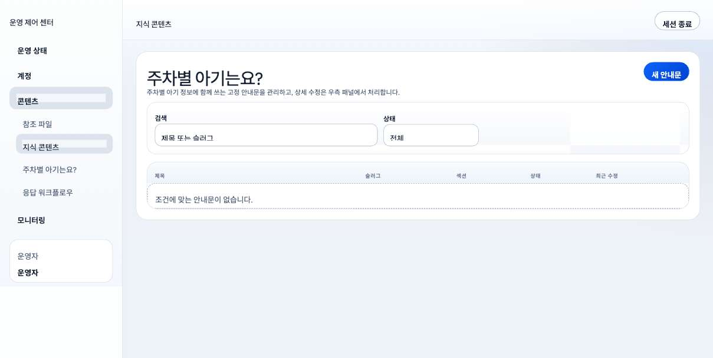
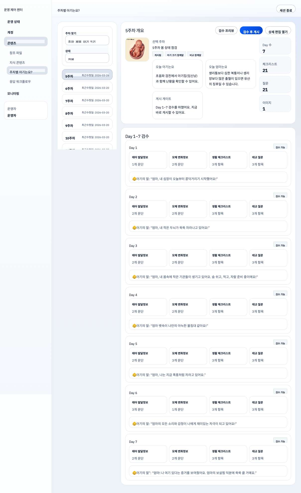
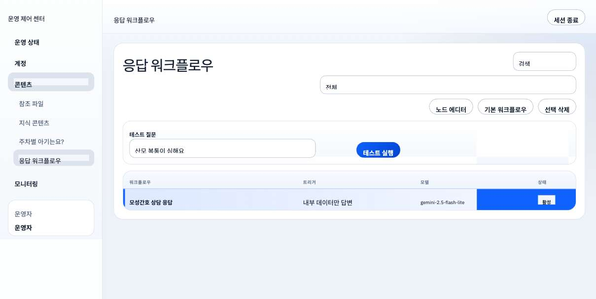
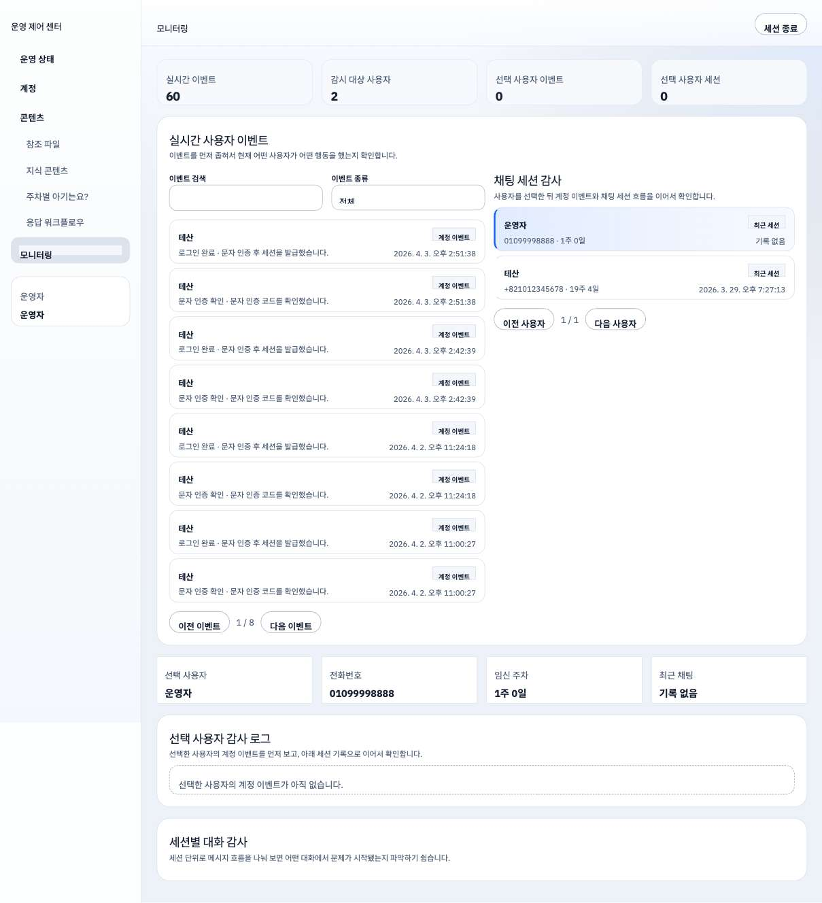

# 개발 완료 보고서

**프로젝트**: 모성간호 AI 상담 챗봇  
**수급자**: 주식회사 룸821 (대표 강정석)  
**발주자**: 이예림 교수님  
**계약 금액**: 14,454,000원 (VAT 포함)  
**보고일**: 2026년 4월 10일

---

## 1. 프로젝트 개요

임산부(예비맘) 대상 AI 기반 모성간호 상담 챗봇 서비스를 구축하였습니다. 사용자 모바일 앱(iOS/Android)과 관리자 웹 콘솔, Cloud Run/Cloud SQL 백엔드로 구성됩니다.

| 항목 | 내용 |
|------|------|
| 착수일 | 2026년 3월 26일 |
| 납품일 | 2026년 4월 10일 |
| 개발 기간 | 16일 (약 2주) |
| 무상 A/S 종료 | 2026년 4월 30일 |

---

## 2. 개발 일정 이행

| 마일스톤 | 계획 | 실제 | 판정 |
|----------|------|------|------|
| M0. 킥오프 | 3/26 | 3/26 | 완료 |
| M1. 개발 완료 | 3/26 ~ 3/31 | 3/26 ~ 3/31 | 완료 |
| M2. QC 1차 + 수정 | 4/1 ~ 4/7 | 4/1 ~ 4/7 | 완료 |
| M3. QC 2차 + 배포 | 4/8 ~ 4/10 | 4/8 ~ 4/10 | 완료 |
| M4. 최종 납품 | 4/10 | 4/10 | 완료 |

---

## 3. 개발 범위 이행 (SOW 기준)

### 3.1 기능 개발

| No. | SOW 항목 | 금액 | 상태 | 비고 |
|-----|----------|------|------|------|
| 1 | 프로젝트 매니징 | 1,000,000원 | 완료 | 주간 진행 보고, 이슈 관리 수행 |
| 2 | 회원가입 및 관리자 패널 | 400,000원 | 완료 | 전화번호 OTP 인증, 1년 세션, 관리자 접근 제어 |
| 3 | 관리자 페이지 (디자인 포함) | 2,200,000원 | 완료 | 사용자 관리, 콘텐츠 CMS, 모니터링, RAG 문서 관리 |
| 4 | 채팅 AI 웹 개발 | 3,800,000원 | 완료 | 가드레일, 감정 분석, 데일리 로그, RAG 기반 응답, 앱 빌드 |
| 5 | 채팅 AI - 워크플로우 구성 | 2,500,000원 | 완료 | Schift 기반 워크플로우, 관리자 제어 UI |
| 6 | 이미지 세팅 | 250,000원 | 완료 | 캐릭터/감정 이미지 초기 세팅 |
| 7 | 서버 비용 (6개월) | 900,000원 | 운영 중 | Cloud Run + Cloud SQL 배포 완료, 9월까지 운영 |
| 8 | 웹사이트 도메인 (1년) | 50,000원 | 완료 | Cloud Run 서비스 URL 적용 |
| 9 | 문자/푸시 연동 | 140,000원 | 완료 | Twilio SMS + Expo 푸시 알림 연동 |
| 10 | 생성형 AI API (6개월) | 600,000원 | 운영 중 | Google Gemini API 연동, 9월까지 운영 |
| 11 | RAG/검색 API (6개월) | 300,000원 | 운영 중 | Schift RAG 검색 연동, 9월까지 운영 |

### 3.2 검수 항목 (AC) 판정

| AC ID | 검수 항목 | 판정 | 근거 |
|-------|----------|------|------|
| AC-001 | 인증 동작 | Pass | 전화번호 OTP, 세션 발급/복원, 관리자 접근 제어 |
| AC-002 | 채팅 응답 | Pass | AI 상담 응답, 오류 시 안내 메시지 |
| AC-003 | 가드레일 | Pass | 입력 필터링, 안전 고지, 의학적 조언 고지 |
| AC-004 | 관리자 조회 | Pass | 운영/계정/모니터링 화면 |
| AC-005 | 자료 관리 | Pass | 주차 콘텐츠, 지식 항목, RAG 문서, 브랜딩 관리 |
| AC-006 | 대화 저장 | Pass | 세션/메시지 저장 및 재조회 |
| AC-007 | 배포 상태 | Pass | 운영 URL 가동, SSL 적용, 앱 빌드 완료 |

---

## 4. 시스템 구성

### 4.1 아키텍처

```
사용자 (모바일 앱) ──→ API 서버 (Next.js / Cloud Run)
                            ├── Cloud SQL (PostgreSQL) + GCS
                            ├── Google Gemini (AI 응답)
                            ├── Schift SDK (RAG + 워크플로우)
                            ├── Twilio (SMS/OTP)
                            └── Expo Server SDK (푸시 알림)

관리자 (웹 콘솔) ────→ Admin API (Next.js / Cloud Run)
```

### 4.2 기술 스택

| 구분 | 기술 |
|------|------|
| 모바일 앱 | Expo 52, React Native 0.76, Expo Router |
| 웹 서버/API | Next.js 15 (App Router), TypeScript |
| 데이터베이스 | PostgreSQL 15 (Cloud SQL) |
| AI 엔진 | Google Gemini + Schift SDK |
| 인증/SMS | Twilio Verify + Messages |
| 푸시 알림 | Expo Server SDK (FCM/APNs) |
| 파일 저장소 | GCS |
| 배포 (웹) | Cloud Run |
| 배포 (앱) | EAS Build (iOS + Android) |
| CI/CD | GitHub Actions (lint → type-check → test → build) |

### 4.3 배포 환경

| 대상 | URL / 위치 | 상태 |
|------|-----------|------|
| 웹/API | `https://agaya-api-yvdnhntt7a-du.a.run.app` | Cloud Run 운영 중 |
| 소스코드 | `https://github.com/yl-star7/gynecology-chatbot` | Public |
| iOS 앱 | EAS Build production (빌드 #7) | 빌드 완료 |
| Android 앱 | EAS Build production (빌드 #7) | 빌드 완료 |
| DB | Cloud SQL/Postgres | 운영 중 |

---

## 5. 개발 산출물 현황

### 5.1 코드 규모

| 항목 | 수치 |
|------|------|
| 총 커밋 | 264건 |
| 소스 파일 (ts/tsx/sql/json) | 743개 |
| TypeScript/TSX 코드 | 약 80,000줄 |
| DB 마이그레이션 | active 3건 + legacy archive |
| 테스트 파일 | 103개 |

### 5.2 주요 모듈

| 모듈 | 경로 | 설명 |
|------|------|------|
| 웹 서버 + 관리자 | `apps/web/` | Next.js 관리자 콘솔, 모바일/관리자 API |
| 모바일 앱 | `apps/mobile/` | Expo Router 기반 사용자 앱 |
| 공용 패키지 | `packages/app-core/` | 도메인 타입, 포트, 테마 프리셋 |
| DB 마이그레이션 | `db/migrations/` | active SQL migration history |
| Legacy 마이그레이션 | `db/migrations_legacy/` | baseline 이전 historical SQL 보관 |

### 5.3 API 엔드포인트

| 영역 | 엔드포인트 수 | 인증 방식 |
|------|-------------|----------|
| 모바일 API (`/api/mobile/*`) | 18개 | Bearer 토큰 세션 |
| 관리자 API (`/api/admin/*`) | 28개 | HTTP 쿠키 세션 |
| 시스템 API (`/api/cron/*`) | 1개 | CRON_SECRET |

### 5.4 데이터베이스

| 구분 | 내용 |
|------|------|
| public 스키마 | 12 테이블 (사용자, 인증, 채팅, 캘린더, 감사 로그 등) |
| content 스키마 | 5 테이블 (지식 항목, RAG 문서, 주차별 콘텐츠 등) |
| 발행 뷰 | 5 뷰 (모바일 읽기 전용) |
| RLS 정책 | 적용 완료 |

---

## 6. 납품물

### 6.1 소스코드 및 배포

| 납품물 | 상태 | 위치 |
|--------|------|------|
| 전체 소스코드 (Git) | 완료 | `github.com/yl-star7/gynecology-chatbot` |
| 웹 운영 배포 | 완료 | Cloud Run |
| 모바일 앱 빌드 (iOS) | 완료 | EAS Build production |
| 모바일 앱 빌드 (Android) | 완료 | EAS Build production |
| DB 운영 환경 | 완료 | Cloud SQL/Postgres |

### 6.2 납품 문서

| 문서 | 파일명 | 상태 |
|------|--------|------|
| 검수 체크리스트 | `납품_검수체크리스트.docx` | 완료 |
| 검수 재현 및 증빙 가이드 | `납품_검수재현및증빙가이드.docx` | 완료 |
| 배포 및 운영 인계서 | `납품_배포및운영인계서.docx` | 완료 |
| 운영증빙 통합작성본 | `운영증빙_통합작성본.docx` | 완료 |
| 기술 문서 (API 명세) | `TECHNICAL_SPECIFICATION.md` | 완료 |
| 관리자 운영 매뉴얼 | `ADMIN_OPERATIONS_MANUAL.md` | 완료 |
| 모바일 릴리스 가이드 | `MOBILE_RELEASE_GUIDE.md` | 완료 |

---

## 7. 보안

| 항목 | 구현 내용 |
|------|----------|
| 전화번호 저장 | AES 암호화 (PHONE_DATA_SECRET) |
| 세션 관리 | 서버 사이드 세션, 1년 유효, 해지 가능 |
| API 인증 | 모바일: Bearer 토큰 / 관리자: HTTP 쿠키 |
| Rate Limiting | 채팅 20회/분, 인증 5~10회/분, 429 + Retry-After |
| 감사 로그 | 관리자 작업 admin_audit_logs 기록 |
| 입력 검증 | URL https 스킴 + 도메인 허용 목록 |
| 시크릿 관리 | 환경변수 전용, git history 완전 제거 완료 |

---

## 8. 운영 항목 (LIM)

아래 항목은 납품 후 운영 기간(2026년 3월 ~ 8월) 동안 제공되며, 운영 증빙은 기간 경과에 따라 별도 수집합니다.

| LIM ID | 항목 | 계약 기준 | 상태 |
|--------|------|----------|------|
| LIM-001 | 이미지 세팅 | 초기 500개 | 세팅 완료 |
| LIM-002 | 문자 발송 | 10,000건 | 연동 완료, 운영 중 |
| LIM-003 | 서버 운영 | 6개월 (3~8월) | 운영 중 |
| LIM-004 | AI API 운영 | 6개월 (3~8월) | 운영 중 |
| LIM-005 | RAG/검색 API 운영 | 6개월 (3~8월) | 운영 중 |
| LIM-006 | 무상 A/S | 4/30까지 | 대응 가능 |

---

## 9. 향후 일정

| 항목 | 기간 | 비고 |
|------|------|------|
| 검수 기간 | 4/10 ~ 4/16 | 납품일 기준 5영업일 |
| 무상 A/S | ~ 4/30 | 계약 범위 내 버그 수정 |
| 서버/API 운영 | ~ 8월 | 6개월 운영 제공 |
| 유상 A/S (선택) | 별도 협의 | 월 500,000원 |

---

## 10. 주요 화면 캡처

### 10.1 사용자 앱 — 모바일 로그인 (OTP 인증)



### 10.2 관리자 콘솔 — 운영 상태

알림 발송, 알림 스케줄 설정, 브랜딩(마스코트/설문) 관리 화면입니다.



### 10.3 관리자 콘솔 — 계정 관리

사용자 검색, 전화번호 변경, 세션 초기화, 사용 중단/재개 기능입니다.



### 10.4 관리자 콘솔 — 참조 파일 (RAG 문서)

PDF/DOCX 파일 업로드 및 지식 문서 관리 화면입니다.



### 10.5 관리자 콘솔 — 지식 콘텐츠

주차별 고정 안내문 관리 화면입니다.



### 10.6 관리자 콘솔 — 주차별 아기는요?

임신 5~40주차 콘텐츠 관리 (아기/엄마 정보, 체크리스트, 질문, 이미지)입니다.



### 10.7 관리자 콘솔 — 응답 워크플로우

AI 응답 워크플로우 설정 및 테스트 실행 화면입니다.



### 10.8 관리자 콘솔 — 모니터링

실시간 사용자 이벤트 및 채팅 세션 감사 화면입니다.



---

## 11. 확인

| 구분 | 성명/직함 | 서명 | 일자 |
|------|----------|------|------|
| 수급자 | 주식회사 룸821 / 강정석 |  | 2026년 4월 10일 |
| 발주자 | / 이예림 |  | 2026년  월  일 |
