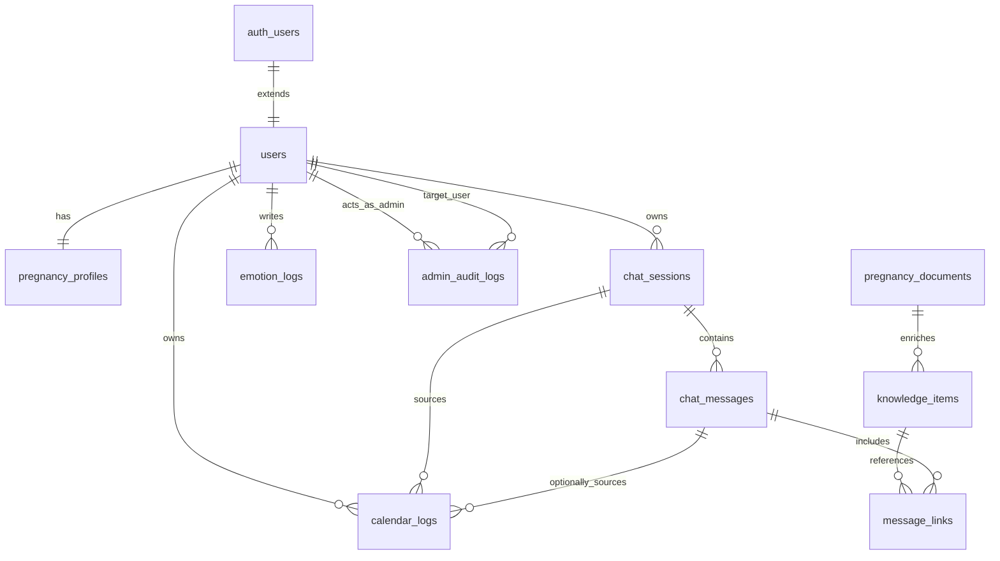

# Supabase Database Schema

> 기준일: 2026-03-14  
> 기준 문서: [PRD.md](/Users/jskang/si/gynecology-chatbot/docs/reference/PRD.md)

이 문서는 현재 제품 방향에 맞는 최소 Supabase 스키마 초안이다.  
웹은 관리자 전용, 모바일은 사용자 전용이며 같은 Supabase 프로젝트를 공유한다.

## 1. 설계 원칙
- 인증은 Supabase Auth를 사용한다.
- 사용자 식별의 주 키는 `auth.users.id`다.
- 앱 데이터는 `public` 스키마에 두고 RLS를 기본 전제로 설계한다.
- 사용자 읽기/쓰기와 관리자 운영 읽기/쓰기 정책은 분리한다.
- 관리자 계정 복구, 운영 수정, 민감 정보 조회는 모두 감사 로그를 남긴다.

## 2. 최소 테이블 목록

### 2.1 `users`
사용자 앱과 관리자 웹이 공통으로 참조하는 기본 프로필 테이블.

| 필드 | 타입 | 설명 |
|------|------|------|
| `id` | `uuid` | PK, `auth.users.id` 참조 |
| `role` | `text` | `user`, `admin`, `super_admin` |
| `phone_number` | `varchar(20)` | 로그인 ID로 쓰는 전화번호 |
| `display_name` | `varchar(100)` | 사용자 표시 이름 |
| `account_status` | `text` | `active`, `paused`, `deleted`, `pending_recovery` |
| `password_hash` | `text` | 앱 로그인용 scrypt 해시 |
| `password_set_at` | `timestamptz` | 최초 비밀번호 설정 시각 |
| `phone_verified_at` | `timestamptz` | 최초 본인인증 완료 시각 |
| `last_login_at` | `timestamptz` | 최근 로그인 시각 |
| `created_at` | `timestamptz` | 생성 시각 |
| `updated_at` | `timestamptz` | 수정 시각 |

### 2.2 `pregnancy_profiles`
사용자 온보딩과 홈 뷰 계산에 필요한 임신 관련 프로필.

| 필드 | 타입 | 설명 |
|------|------|------|
| `id` | `uuid` | PK |
| `user_id` | `uuid` | FK -> `users.id` |
| `pregnancy_status` | `text` | `pregnant`, `trying`, `general` |
| `pregnancy_day_count` | `integer` | 홈 뷰 직접 표기용 |
| `pregnancy_week` | `integer` | 주차 계산용 |
| `pregnancy_day_in_week` | `integer` | 주차 내 일수 |
| `due_date` | `date` | 예정일 |
| `onboarding_payload` | `jsonb` | 온보딩 원본 |
| `created_at` | `timestamptz` | 생성 시각 |
| `updated_at` | `timestamptz` | 수정 시각 |

### 2.3 `chat_sessions`
사용자 앱의 recent chat와 채팅 세션 목록.

| 필드 | 타입 | 설명 |
|------|------|------|
| `id` | `uuid` | PK |
| `user_id` | `uuid` | FK -> `users.id` |
| `title` | `varchar(200)` | 최근 대화 요약 제목 |
| `status` | `text` | `active`, `archived` |
| `last_message_at` | `timestamptz` | recent chat 정렬용 |
| `created_at` | `timestamptz` | 생성 시각 |
| `updated_at` | `timestamptz` | 수정 시각 |

### 2.4 `chat_messages`
텍스트/이미지/카드/설문/링크 응답을 JSON 파트 단위로 저장.

| 필드 | 타입 | 설명 |
|------|------|------|
| `id` | `uuid` | PK |
| `session_id` | `uuid` | FK -> `chat_sessions.id` |
| `user_id` | `uuid` | FK -> `users.id` |
| `role` | `text` | `user`, `assistant`, `system` |
| `parts` | `jsonb` | 앱 렌더링용 메시지 파트 배열 |
| `plain_text` | `text` | 검색/요약용 평문 |
| `image_attachments` | `jsonb` | 사용자 업로드 이미지 메타데이터 |
| `model_name` | `varchar(100)` | 예: `gemini-2.5-flash-lite` |
| `created_at` | `timestamptz` | 생성 시각 |

`parts`는 아래 타입만 허용한다.
- `text`
- `survey`
- `carousel`
- `image`
- `deepLink`

### 2.5 `emotion_logs`
캘린더 배경색과 감정 추이를 위한 일자별 감정 기록.

| 필드 | 타입 | 설명 |
|------|------|------|
| `id` | `uuid` | PK |
| `user_id` | `uuid` | FK -> `users.id` |
| `date` | `date` | 기록 날짜 |
| `emotion_tone` | `text` | `calm`, `joyful`, `anxious`, `tired`, `sad` |
| `note` | `text` | 간단 메모 |
| `source` | `text` | `manual`, `chat_inferred`, `survey` |
| `created_at` | `timestamptz` | 생성 시각 |

### 2.6 `calendar_logs`
캘린더 일자별 기록 상세. 홈 달력 dot와 상세 뷰의 기반.

| 필드 | 타입 | 설명 |
|------|------|------|
| `id` | `uuid` | PK |
| `user_id` | `uuid` | FK -> `users.id` |
| `session_id` | `uuid` | FK -> `chat_sessions.id` |
| `message_id` | `uuid` | FK -> `chat_messages.id`, nullable |
| `date` | `date` | 기록 날짜 |
| `entry_type` | `text` | `chat_saved`, `symptom_note`, `ai_summary`, `emotion_checkin` |
| `title` | `varchar(200)` | 기록 제목 |
| `summary` | `text` | 목록용 요약 |
| `payload` | `jsonb` | 세부 정보 |
| `created_at` | `timestamptz` | 생성 시각 |

기본 연결 규칙:
- 일반 열람/복귀 동선은 `session_id` 기준
- 특정 저장 답변을 직접 복귀해야 할 때만 `message_id` 사용

### 2.7 `knowledge_items`
앱 내부 딥링크 대상이 되는 임신 지식/체크리스트/안내 콘텐츠.

| 필드 | 타입 | 설명 |
|------|------|------|
| `id` | `uuid` | PK |
| `slug` | `varchar(120)` | 내부 링크 slug |
| `section` | `text` | `knowledge`, `notebook` |
| `title` | `varchar(200)` | 제목 |
| `body` | `text` | 본문 |
| `card_payload` | `jsonb` | 카드/캐러셀 렌더링용 부가 데이터 |
| `status` | `text` | `draft`, `published`, `archived` |
| `published_at` | `timestamptz` | 공개 시각 |
| `updated_at` | `timestamptz` | 수정 시각 |

### 2.8 `message_links`
어떤 assistant 메시지가 어떤 앱 내부 링크를 포함했는지 추적.

| 필드 | 타입 | 설명 |
|------|------|------|
| `id` | `uuid` | PK |
| `message_id` | `uuid` | FK -> `chat_messages.id` |
| `knowledge_item_id` | `uuid` | FK -> `knowledge_items.id` |
| `target_section` | `text` | `knowledge`, `notebook` |
| `created_at` | `timestamptz` | 생성 시각 |

### 2.10 `pregnancy_documents`
임신 주차별 RAG 검색용 문서 청크.

| 필드 | 타입 | 설명 |
|------|------|------|
| `id` | `uuid` | PK |
| `title` | `varchar(500)` | 문서 제목 |
| `content` | `text` | 청크 본문 |
| `pregnancy_week` | `integer` | 관련 주차, null 가능 |
| `category` | `varchar(100)` | 카테고리 |
| `embedding` | `vector(1536)` | Gemini embedding |
| `metadata` | `jsonb` | 출처/태그/링크 메타데이터 |
| `created_at` | `timestamptz` | 생성 시각 |

### 2.9 `admin_audit_logs`
계정 복구와 관리자 수정 작업을 기록.

| 필드 | 타입 | 설명 |
|------|------|------|
| `id` | `uuid` | PK |
| `admin_user_id` | `uuid` | FK -> `users.id` |
| `target_user_id` | `uuid` | FK -> `users.id`, nullable |
| `action_type` | `text` | `phone_change`, `login_id_change`, `password_reset`, `content_update`, `knowledge_publish` |
| `entity_type` | `text` | `user`, `knowledge_item`, `calendar_log` 등 |
| `entity_id` | `uuid` | 대상 엔티티 ID |
| `reason` | `text` | 변경 사유 |
| `before_payload` | `jsonb` | 변경 전 값 |
| `after_payload` | `jsonb` | 변경 후 값 |
| `created_at` | `timestamptz` | 실행 시각 |

## 3. 권한 정책 초안

### 3.1 사용자
- 본인 `chat_sessions`, `chat_messages`, `emotion_logs`, `calendar_logs`, `pregnancy_profiles`만 조회 가능
- 본인 데이터만 생성 가능
- `knowledge_items`는 published 상태만 읽기 가능

### 3.2 관리자
- 관리자 웹에서 운영 목적 조회 가능
- 계정 복구/콘텐츠 수정 시 `admin_audit_logs` 기록 필수
- 사용자 민감 데이터는 직접 수정 가능한 필드만 제한적으로 허용
- 기본 role은 `admin`
- 일반 운영 액션과 콘텐츠 운영 액션 수행 가능
- 관리자 계정 자체의 생성/권한 변경은 불가

### 3.3 슈퍼 관리자
- 관리자 계정 관리
- 고위험 계정 복구 승인
- 운영 로그 전부 조회
- `users.role = 'super_admin'`
- 관리자 계정 생성/비활성화/role 변경 가능
- 위험 작업 승인 워크플로우 최종 권한 보유

## 3.4 휴대폰 인증 단계 구조

### `mock`
- 실제 SMS 발송 없음
- 인증 코드 입력 흐름과 검증 인터페이스만 유지
- 개발/QA 용도

### `sms_otp`
- 실제 운영 기본안
- SMS 벤더를 통해 OTP 발송
- Supabase Auth Hook 또는 커스텀 OTP 저장/검증 구조 사용
- `users.phone_verified_at`는 성공 시점 기록

### `identity_verification`
- 실명/통신사 기반 본인확인
- 단순 로그인보다 계정 복구나 민감 작업 보호에 적합
- 필요 시 별도 verification result 테이블 확장 가능

## 4. 홈 뷰 조회에 필요한 집계

모바일 홈은 아래 데이터 조합으로 구성한다.
- `users.display_name`
- `pregnancy_profiles.pregnancy_day_count`
- 특정 월의 `calendar_logs`
- 특정 월의 `emotion_logs`

홈 달력 한 칸 렌더링 규칙:
- 같은 날짜 `calendar_logs`가 1건 이상 있으면 `hasChat = true`
- 같은 날짜 `emotion_logs`가 있으면 `emotionTone` 채움

## 5. Recent Chat 조회 규칙
- `chat_sessions`를 `last_message_at DESC`로 조회
- 각 row에 대해 최신 `chat_messages.plain_text` 일부를 preview로 사용

## 6. 채팅 저장 규칙
- 사용자 입력은 `chat_messages.role = 'user'`
- AI 응답은 `chat_messages.role = 'assistant'`
- 화면 렌더링 계약은 `parts` JSON으로 유지
- 캘린더 저장 시 `calendar_logs`에 별도 entry 생성
- 일반 복귀는 `session_id`, 특정 저장 메시지 복귀는 `message_id`

## 7. RAG 조회 규칙
- `pregnancy_profiles.pregnancy_week`를 기본 필터로 사용
- 관련 주차 문서와 공통 문서를 함께 조회할 수 있어야 함
- AI 응답에서 생성된 deep link는 `knowledge_items` 또는 `notebook` 섹션으로 연결

## 8. 구현 우선순위
1. `users`
2. `pregnancy_profiles`
3. `chat_sessions`
4. `chat_messages`
5. `emotion_logs`
6. `calendar_logs`
7. `knowledge_items`
8. `pregnancy_documents`
9. `admin_audit_logs`
10. `message_links`

## 9. 제외 항목
현재 단계에서는 아래를 넣지 않는다.
- 카카오 OAuth 전용 필드
- 이메일 로그인 전용 필드
- 오프라인 동기화 큐
- 복잡한 survey template 엔진
