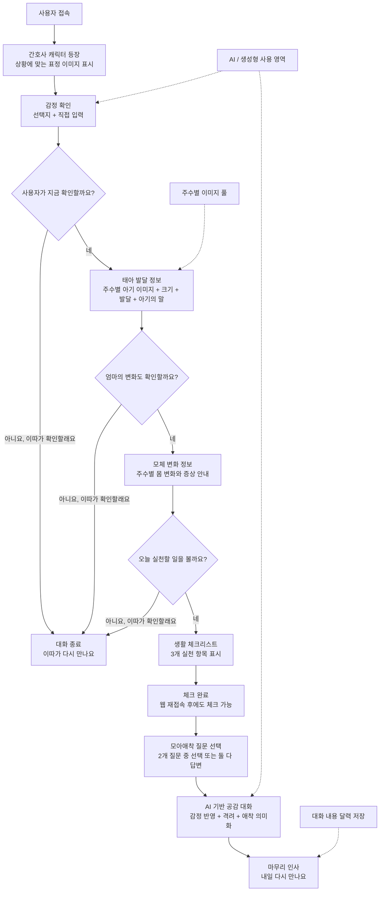
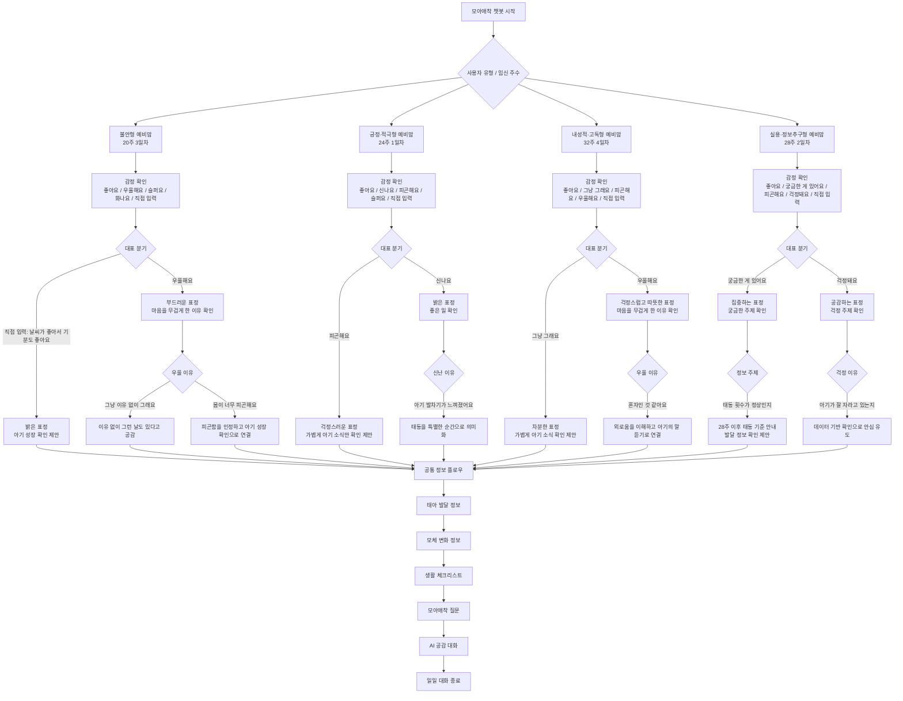
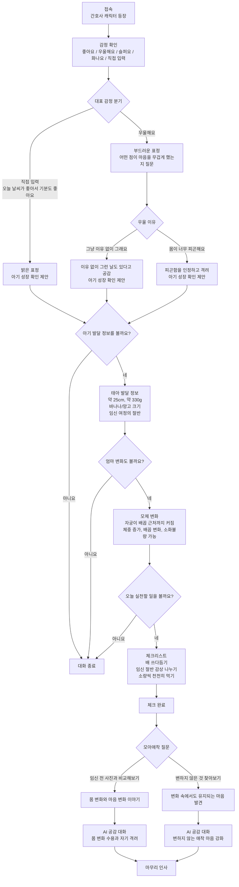
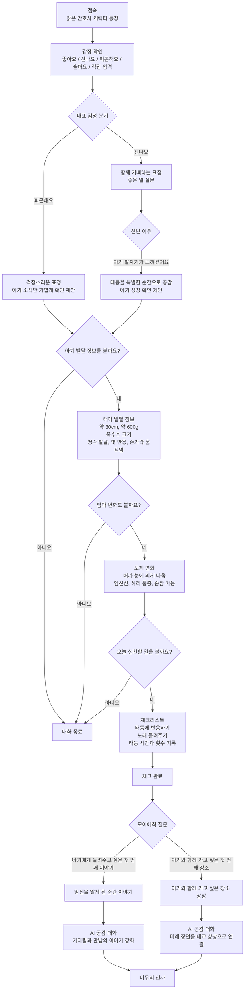
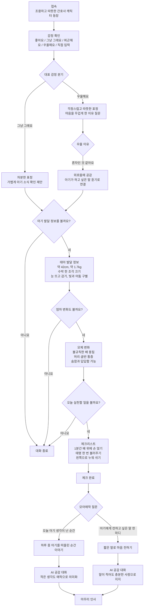
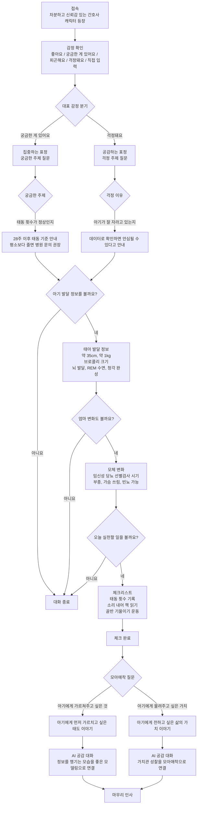

# 모아애착 챗봇 플로우 Mermaid 정리

## 1. 공통 설계 구조

```mermaid
flowchart TD
    A["사용자 접속"] --> B["간호사 캐릭터 등장<br/>상황에 맞는 표정 이미지 표시"]
    B --> C["감정 확인<br/>선택지 + 직접 입력"]
    C --> D{"사용자가 지금 확인할까요?"}
    D -- "아니요, 이따가 확인할래요" --> Z["대화 종료<br/>이따가 다시 만나요"]
    D -- "네" --> E["태아 발달 정보<br/>주수별 아기 이미지 + 크기 + 발달 + 아기의 말"]
    E --> F{"엄마의 변화도 확인할까요?"}
    F -- "아니요, 이따가 확인할래요" --> Z
    F -- "네" --> G["모체 변화 정보<br/>주수별 몸 변화와 증상 안내"]
    G --> H{"오늘 실천할 일을 볼까요?"}
    H -- "아니요, 이따가 확인할래요" --> Z
    H -- "네" --> I["생활 체크리스트<br/>3개 실천 항목 표시"]
    I --> J["체크 완료<br/>웹 재접속 후에도 체크 가능"]
    J --> K["모아애착 질문 선택<br/>2개 질문 중 선택 또는 둘 다 답변"]
    K --> L["AI 기반 공감 대화<br/>감정 반영 + 격려 + 애착 의미화"]
    L --> M["마무리 인사<br/>내일 다시 만나요"]

    N["AI / 생성형 사용 영역"] -.-> C
    N -.-> L
    O["주수별 이미지 풀"] -.-> E
    P["대화 내용 달력 저장"] -.-> M
```

## 2. 페르소나별 전체 흐름

```mermaid
flowchart TD
    Start["모아애착 챗봇 시작"] --> Persona{"사용자 유형 / 임신 주수"}

    Persona --> P1["불안형 예비맘<br/>20주 3일차"]
    Persona --> P2["긍정·적극형 예비맘<br/>24주 1일차"]
    Persona --> P3["내성적·고독형 예비맘<br/>32주 4일차"]
    Persona --> P4["실용·정보추구형 예비맘<br/>28주 2일차"]

    P1 --> P1Emotion["감정 확인<br/>좋아요 / 우울해요 / 슬퍼요 / 화나요 / 직접 입력"]
    P1Emotion --> P1Branch{"대표 분기"}
    P1Branch -- "직접 입력: 날씨가 좋아서 기분도 좋아요" --> P1Positive["밝은 표정<br/>아기 성장 확인 제안"]
    P1Branch -- "우울해요" --> P1Low["부드러운 표정<br/>마음을 무겁게 한 이유 확인"]
    P1Low --> P1LowReason{"우울 이유"}
    P1LowReason -- "그냥 이유 없이 그래요" --> P1Empathy1["이유 없이 그런 날도 있다고 공감"]
    P1LowReason -- "몸이 너무 피곤해요" --> P1Empathy2["피곤함을 인정하고 아기 성장 확인으로 연결"]

    P2 --> P2Emotion["감정 확인<br/>좋아요 / 신나요 / 피곤해요 / 슬퍼요 / 직접 입력"]
    P2Emotion --> P2Branch{"대표 분기"}
    P2Branch -- "피곤해요" --> P2Tired["걱정스러운 표정<br/>가볍게 아기 소식만 확인 제안"]
    P2Branch -- "신나요" --> P2Happy["밝은 표정<br/>좋은 일 확인"]
    P2Happy --> P2Reason{"신난 이유"}
    P2Reason -- "아기 발차기가 느껴졌어요" --> P2Kick["태동을 특별한 순간으로 의미화"]

    P3 --> P3Emotion["감정 확인<br/>좋아요 / 그냥 그래요 / 피곤해요 / 우울해요 / 직접 입력"]
    P3Emotion --> P3Branch{"대표 분기"}
    P3Branch -- "그냥 그래요" --> P3Neutral["차분한 표정<br/>가볍게 아기 소식 확인 제안"]
    P3Branch -- "우울해요" --> P3Low["걱정스럽고 따뜻한 표정<br/>마음을 무겁게 한 이유 확인"]
    P3Low --> P3Reason{"우울 이유"}
    P3Reason -- "혼자인 것 같아요" --> P3Lonely["외로움을 이해하고 아기의 말 듣기로 연결"]

    P4 --> P4Emotion["감정 확인<br/>좋아요 / 궁금한 게 있어요 / 피곤해요 / 걱정돼요 / 직접 입력"]
    P4Emotion --> P4Branch{"대표 분기"}
    P4Branch -- "궁금한 게 있어요" --> P4Question["집중하는 표정<br/>궁금한 주제 확인"]
    P4Question --> P4Topic{"정보 주제"}
    P4Topic -- "태동 횟수가 정상인지" --> P4KickCount["28주 이후 태동 기준 안내<br/>발달 정보 확인 제안"]
    P4Branch -- "걱정돼요" --> P4Worry["공감하는 표정<br/>걱정 주제 확인"]
    P4Worry --> P4WorryReason{"걱정 이유"}
    P4WorryReason -- "아기가 잘 자라고 있는지" --> P4Data["데이터 기반 확인으로 안심 유도"]

    P1Positive --> Common["공통 정보 플로우"]
    P1Empathy1 --> Common
    P1Empathy2 --> Common
    P2Tired --> Common
    P2Kick --> Common
    P3Neutral --> Common
    P3Lonely --> Common
    P4KickCount --> Common
    P4Data --> Common

    Common --> Baby["태아 발달 정보"]
    Baby --> Mother["모체 변화 정보"]
    Mother --> Checklist["생활 체크리스트"]
    Checklist --> Reflection["모아애착 질문"]
    Reflection --> Gpt["AI 공감 대화"]
    Gpt --> End["일일 대화 종료"]
```

## 3. 20주 3일차 - 불안형 예비맘

```mermaid
flowchart TD
    A["접속<br/>간호사 캐릭터 등장"] --> B["감정 확인<br/>좋아요 / 우울해요 / 슬퍼요 / 화나요 / 직접 입력"]
    B --> C{"대표 감정 분기"}
    C -- "직접 입력<br/>오늘 날씨가 좋아서 기분도 좋아요" --> D["밝은 표정<br/>아기 성장 확인 제안"]
    C -- "우울해요" --> E["부드러운 표정<br/>어떤 점이 마음을 무겁게 했는지 질문"]
    E --> F{"우울 이유"}
    F -- "그냥 이유 없이 그래요" --> G["이유 없이 그런 날도 있다고 공감<br/>아기 성장 확인 제안"]
    F -- "몸이 너무 피곤해요" --> H["피곤함을 인정하고 격려<br/>아기 성장 확인 제안"]

    D --> I{"아기 발달 정보를 볼까요?"}
    G --> I
    H --> I
    I -- "아니요" --> X["대화 종료"]
    I -- "네" --> J["태아 발달 정보<br/>약 25cm, 약 330g<br/>바나나/망고 크기<br/>임신 여정의 절반"]
    J --> K{"엄마 변화도 볼까요?"}
    K -- "아니요" --> X
    K -- "네" --> L["모체 변화<br/>자궁이 배꼽 근처까지 커짐<br/>체중 증가, 배꼽 변화, 소화불량 가능"]
    L --> M{"오늘 실천할 일을 볼까요?"}
    M -- "아니요" --> X
    M -- "네" --> N["체크리스트<br/>배 쓰다듬기<br/>임신 절반 감상 나누기<br/>소량씩 천천히 먹기"]
    N --> O["체크 완료"]
    O --> P{"모아애착 질문"}
    P -- "임신 전 사진과 비교해보기" --> Q["몸 변화와 마음 변화 이야기"]
    P -- "변하지 않은 것 찾아보기" --> R["변화 속에서도 유지되는 마음 발견"]
    Q --> S["AI 공감 대화<br/>몸 변화 수용과 자기 격려"]
    R --> T["AI 공감 대화<br/>변하지 않는 애착 마음 강화"]
    S --> U["마무리 인사"]
    T --> U
```

## 4. 24주 1일차 - 긍정·적극형 예비맘

```mermaid
flowchart TD
    A["접속<br/>밝은 간호사 캐릭터 등장"] --> B["감정 확인<br/>좋아요 / 신나요 / 피곤해요 / 슬퍼요 / 직접 입력"]
    B --> C{"대표 감정 분기"}
    C -- "피곤해요" --> D["걱정스러운 표정<br/>아기 소식만 가볍게 확인 제안"]
    C -- "신나요" --> E["함께 기뻐하는 표정<br/>좋은 일 질문"]
    E --> F{"신난 이유"}
    F -- "아기 발차기가 느껴졌어요" --> G["태동을 특별한 순간으로 공감<br/>아기 성장 확인 제안"]

    D --> H{"아기 발달 정보를 볼까요?"}
    G --> H
    H -- "아니요" --> X["대화 종료"]
    H -- "네" --> I["태아 발달 정보<br/>약 30cm, 약 600g<br/>옥수수 크기<br/>청각 발달, 빛 반응, 손가락 움직임"]
    I --> J{"엄마 변화도 볼까요?"}
    J -- "아니요" --> X
    J -- "네" --> K["모체 변화<br/>배가 눈에 띄게 나옴<br/>임신선, 허리 통증, 숨참 가능"]
    K --> L{"오늘 실천할 일을 볼까요?"}
    L -- "아니요" --> X
    L -- "네" --> M["체크리스트<br/>태동에 반응하기<br/>노래 들려주기<br/>태동 시간과 횟수 기록"]
    M --> N["체크 완료"]
    N --> O{"모아애착 질문"}
    O -- "아기에게 들려주고 싶은 첫 번째 이야기" --> P["임신을 알게 된 순간 이야기"]
    O -- "아기와 함께 가고 싶은 첫 번째 장소" --> Q["아기와 함께 가고 싶은 장소 상상"]
    P --> R["AI 공감 대화<br/>기다림과 만남의 이야기 강화"]
    Q --> S["AI 공감 대화<br/>미래 장면을 태교 상상으로 연결"]
    R --> T["마무리 인사"]
    S --> T
```

## 5. 32주 4일차 - 내성적·고독형 예비맘

```mermaid
flowchart TD
    A["접속<br/>조용하고 따뜻한 간호사 캐릭터 등장"] --> B["감정 확인<br/>좋아요 / 그냥 그래요 / 피곤해요 / 우울해요 / 직접 입력"]
    B --> C{"대표 감정 분기"}
    C -- "그냥 그래요" --> D["차분한 표정<br/>가볍게 아기 소식 확인 제안"]
    C -- "우울해요" --> E["걱정스럽고 따뜻한 표정<br/>마음을 무겁게 한 이유 질문"]
    E --> F{"우울 이유"}
    F -- "혼자인 것 같아요" --> G["외로움에 공감<br/>아기가 하고 싶은 말 듣기로 연결"]

    D --> H{"아기 발달 정보를 볼까요?"}
    G --> H
    H -- "아니요" --> X["대화 종료"]
    H -- "네" --> I["태아 발달 정보<br/>약 42cm, 약 1.7kg<br/>수박 한 조각 크기<br/>눈 뜨고 감기, 빛과 어둠 구별"]
    I --> J{"엄마 변화도 볼까요?"}
    J -- "아니요" --> X
    J -- "네" --> K["모체 변화<br/>불규칙한 배 뭉침<br/>허리·골반 통증<br/>숨참과 답답함 가능"]
    K --> L{"오늘 실천할 일을 볼까요?"}
    L -- "아니요" --> X
    L -- "네" --> M["체크리스트<br/>1분간 배 위에 손 얹기<br/>태명 한 번 불러주기<br/>왼쪽으로 누워 쉬기"]
    M --> N["체크 완료"]
    N --> O{"모아애착 질문"}
    O -- "오늘 아기 생각이 난 순간" --> P["하루 중 아기를 떠올린 순간 이야기"]
    O -- "아기에게 전하고 싶은 말 한 마디" --> Q["짧은 말로 마음 전하기"]
    P --> R["AI 공감 대화<br/>작은 생각도 애착으로 의미화"]
    Q --> S["AI 공감 대화<br/>말이 적어도 충분한 사랑으로 지지"]
    R --> T["마무리 인사"]
    S --> T
```

## 6. 28주 2일차 - 실용·정보추구형 예비맘

```mermaid
flowchart TD
    A["접속<br/>차분하고 신뢰감 있는 간호사 캐릭터 등장"] --> B["감정 확인<br/>좋아요 / 궁금한 게 있어요 / 피곤해요 / 걱정돼요 / 직접 입력"]
    B --> C{"대표 감정 분기"}
    C -- "궁금한 게 있어요" --> D["집중하는 표정<br/>궁금한 주제 질문"]
    D --> E{"궁금한 주제"}
    E -- "태동 횟수가 정상인지" --> F["28주 이후 태동 기준 안내<br/>평소보다 줄면 병원 문의 권장"]
    C -- "걱정돼요" --> G["공감하는 표정<br/>걱정 주제 질문"]
    G --> H{"걱정 이유"}
    H -- "아기가 잘 자라고 있는지" --> I["데이터로 확인하면 안심될 수 있다고 안내"]

    F --> J{"아기 발달 정보를 볼까요?"}
    I --> J
    J -- "아니요" --> X["대화 종료"]
    J -- "네" --> K["태아 발달 정보<br/>약 35cm, 약 1kg<br/>브로콜리 크기<br/>뇌 발달, REM 수면, 청각 완성"]
    K --> L{"엄마 변화도 볼까요?"}
    L -- "아니요" --> X
    L -- "네" --> M["모체 변화<br/>임신성 당뇨 선별검사 시기<br/>부종, 가슴 쓰림, 빈뇨 가능"]
    M --> N{"오늘 실천할 일을 볼까요?"}
    N -- "아니요" --> X
    N -- "네" --> O["체크리스트<br/>태동 횟수 기록<br/>소리 내어 책 읽기<br/>골반 기울이기 운동"]
    O --> P["체크 완료"]
    P --> Q{"모아애착 질문"}
    Q -- "아기에게 가르쳐주고 싶은 것" --> R["아기에게 먼저 가르치고 싶은 태도 이야기"]
    Q -- "아기에게 물려주고 싶은 가치" --> S["아기에게 전하고 싶은 삶의 가치 이야기"]
    R --> T["AI 공감 대화<br/>정보를 챙기는 모습을 좋은 모델링으로 연결"]
    S --> U["AI 공감 대화<br/>가치관 성찰을 모아애착으로 연결"]
    T --> V["마무리 인사"]
    U --> V
```
